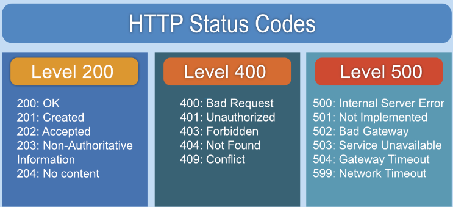

## HTTP (HyperText Transfer Protocol)

- world wide web을 위한 데이터 통신의 기초이자 웹 사이트를 이용하는 데 쓰는 프로토콜
- HTTP는 암호화가 되지 않아 데이터가 중간에 노출될 위험이 있다.
- HTTP 상태 코드는 클라이언트가 서버에 요청을 보냈을 때, 서버가 그 요청에 대한 응답으로 돌려주는 3자리의 숫자 코드이다.

 

#### status code

https://restfulapi.net/http-status-codes/

##### success

- 200 : OK
  문제 없이 요청에 대한 처리가 서버에서 이뤄지고 오는 응답 코드

- 201 : Created
  대게 POST 메소드의 요청에 따라 서버에 데이터가 생성, 수정되었을 때 보내는 코드

- 204 : No Content
  성공적으로 삭제되어서 응답에 제공할 콘텐츠가 없을 때 보내는 코드

##### client error

- 400 : Bad Request
  클라이언트가 잘못된 요청을 보냈을 때 사용되는 코드

- 401 : Unauthorized
  인증이 되지 않았을 때 보내는 코드
  ex) 로그인이 되지 않은 상태에서 장바구니에 물건을 담았을 경우

- 403 : Forbidden
  유저가 접근 불가능한 정보에 접근했을 경우 보내는 코드
  ex) 프리미엄 회원만 접근 가능할 경우

- 404 : Not FOund
  요청된 url이 존재하지 않는다는 의미를 나타내는 코드

##### server error

- 500 : internal server Error
  서버에서 에러가 났을 때 나타나는 코드

 
 

## HTTPS (HTTP Secure)

- HTTP의 보안 강화 버전
- SSL(Secure Sockets Layer) 또는 TLS(Transport Layer Security) 프로토콜을 사용하여 통신을 암호화한다.
- 이를 통해 데이터의 무결성이 보장되고, 중간자 공격(Man-in-the-Middle Attack)으로부터 보호받을 수 있다.

 
 

## 면접질문

HTTP 헤더와 바디의 차이점?

HTTP 헤더는 요청과 응답의 메타데이터를 포함하며, 데이터의 본문을 설명합니다.
반면에 HTTP 바디는 실제로 전송되는 데이터 자체를 담고 있습니다.

HTTP 프로토콜이 stateless하다는 것의 의미?

각 요청이 독립적이라는 뜻입니다.
즉, 이전 요청에 대한 정보가 현재의 요청에 영향을 미치지 않습니다.

HTTP 상태 코드에 대해

HTTP 상태 코드는 서버가 클라이언트의 요청을 어떻게 처리했는지를 나타내는 3자리 숫자입니다.
예를 들어 200은 성공적으로 처리했음을 의미하고, 404는 요청한 페이지를 찾을 수 없음을, 500은 서버 내부 오류가 발생했음을 나타냅니다.

HTTP와 HTTPS의 주요 차이점?

HTTP는 암호화가 되지 않은 반면, HTTPS는 SSL/TLS를 통해 데이터 통신을 암호화하여 보안을 강화한 것이 가장 큰 차이점입니다.
이로 인해 HTTPS는 데이터의 무결성을 보장하고 중간자 공격으로부터 보호할 수 있습니다.

HTTPS가 HTTP보다 느린 이유?

HTTPS는 SSL/TLS를 통해 데이터를 암호화하고 복호화하는 과정이 필요하므로 시간이 더 소요됩니다.

