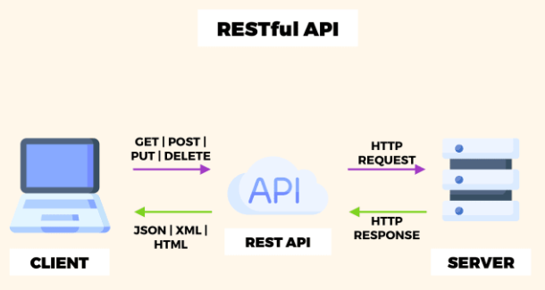

## RESTful API

- REST(Representational State Transfer) 원칙을 따르는 API(Application Programming Interface)
- REST는 HTTP URI를 통해 자원을 명시하고,
  HTTP Method를 통해 해당 자원에 대한 CRUD를 적용하는 것을 의미한다.
- REST API를 제공하는 웹 서비스를 RESTful하다고 한다.

 

#### RESTful API 설계 시 고려해야 할 원칙 (REST의 특징)

- Stateless (무상태성) : 각 요청이 서버에게 필요한 모든 정보를 담고 있어야 하며, 서버는 클라이언트의 상태를 저장하거나 이전 요청을 기억해서는 안 된다.
- Client-Server (클라이언트-서버 구조) : 클라이언트와 서버는 각자의 역할에 집중하며, 서로 독립적으로 발전한다.
- Cacheable (캐시 가능) : 클라이언트가 서버의 응답을 캐시해 재사용할 수 있어야 한다.
- Layered System(계층화) : 클라이언트가 직접 최종 서버에 연결되지 않을 수도 있다.
  즉, 중간에 여러 계층(로드 밸런서, 캐시 서버 등)이 위치할 수 있는데 클라이언트는 이를 알지 못하며, 마치 직접 최종 서버에 연결된 것처럼 동작한다.
- Uniform Interface (통일된 인터페이스) : API는 일관된 인터페이스를 제공해야 한다.

 

#### REST API 설계 규칙

1. URI는 동사보다는 명사를, 대문자보다는 소문자를 사용하여야 한다.

Bad Example http://yueun.com/Running/
Good Example http://yueun.com/run/

2. 마지막에 슬래시 (/)를 포함하지 않는다.

Bad Example http://yueun.com/test/  
Good Example http://yueun.com/test

3. 언더바 대신 하이폰을 사용한다.

Bad Example http://yueun.com/test_blog
Good Example http://yueun.com/test-blog

4. 파일확장자는 URI에 포함하지 않는다.

Bad Example http://yueun.com/photo.jpg  
Good Example http://yueun.com/photo

5. 행위를 포함하지 않는다.

Bad Example http://yueun.com/delete-post/1  
Good Example http://yueun.com/post/1

 

#### RESTful API의 장점과 단점

##### 장점

- 직관적이고 간결한 구조 : RESTful API는 자원 중심의 직관적인 구조를 가지고 있다. 이는 API의 엔드포인트를 설계하는 데 있어 직관적인 방식을 제공해 개발자들이 API를 쉽게 이해하고 사용할 수 있게 한다.

- 높은 확장성 : RESTful API는 무상태성을 통해 서버의 확장성을 향상시킨다.
  각 요청이 독립적이라는 특성 덕분에, 로드 밸런싱 등을 통해 서버의 확장성을 쉽게 관리할 수 있다.
- HTTP 프로토콜 활용 : RESTful API는 HTTP 프로토콜을 그대로 활용하기 때문에 기존 웹 인프라를 그대로 활용할 수 있다.
- 서버와 클라이언트의 역할 분리 : RESTful API는 서버와 클라이언트의 역할을 명확하게 분리한다.
  이로 인해 서버와 클라이언트는 각자의 역할에 집중할 수 있고 독립적으로 발전시킬 수 있다.

##### 단점

- 연속적인 트랜잭션 처리의 어려움 : RESTful API는 무상태성을 가지기 때문에 연속적인 트랜잭션을 처리하는 것이 어렵다.
  각 요청이 독립적이므로, 이전 요청의 상태를 기억하지 않아 여러 요청이 연계되어야 하는 상황에서는 적합하지 않을 수 있다.
- HTTP 메소드의 제한성 : RESTful API는 기본적으로 HTTP 메소드인 GET, POST, PUT, DELETE만 사용한다.
- 보안 이슈 : HTTP를 사용하므로 데이터 전송 시 보안에 주의해야 한다.
  특히, 민감한 정보를 전송할 때는 HTTPS 등의 보안 프로토콜을 사용해야 한다.
- 실시간 서비스 구현의 어려움 : RESTful API는 연결 상태를 유지하지 않기 때문에 실시간 서비스 구현이 어렵다.

 
 

## 면접 질문

REST와 SOAP의 차이점?

REST는 상태를 유지하지 않는 아키텍처 스타일이며 HTTP를 기반으로 합니다.
반면, SOAP는 상태를 유지하는 프로토콜로 XML 기반의 메시지 형식을 사용하며 HTTP 외에도 다른 프로토콜을 통해서도 통신이 가능합니다.

RESTful API에서 인증과 권한 관리는 어떻게 이루어지는지?

일반적으로 토큰 기반 인증 방식인 OAuth를 사용합니다. 클라이언트는 처음 로그인할 때 아이디와 비밀번호를 이용하고, 이후에는 서버로부터 발급받은 토큰을 이용해 요청을 보냅니다.
서버는 이 토큰을 검증하여 클라이언트의 인증 상태와 권한을 확인합니다.

