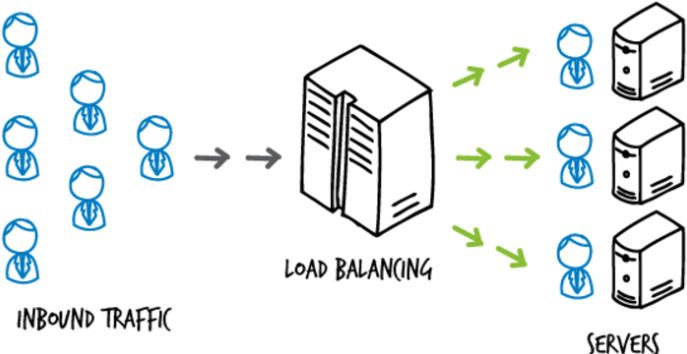
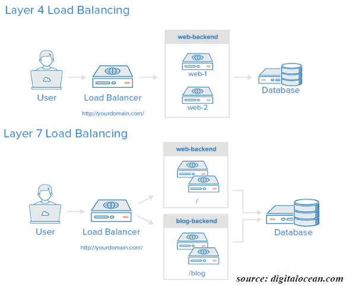

## 로드밸런싱 (load balancing)

- 여러 개의 서버가 작업을 분산 처리하도록 하는 기술
- 네트워크 트래픽이나 리소스 요청을 여러 서버나 데이터 센터에 고르게 분산시키는 역할을 한다.

 

#### 로드 밸런싱의 주요 목적

- 고가용성과 신뢰성 : 한 서버에 문제가 생겼을 때 다른 서버가 그 작업을 인수하게 하여 서비스 중단을 최소화한다.
- 확장성 : 트래픽이 늘어나면 추가적인 서버를 통해 서비스의 규모를 쉽게 확장할 수 있다.
- 부하 분산 : 네트워크 트래픽이나 세션, CPU 부하 등을 여러 서버에 분산시켜 각 서버의 부하를 줄인다.

 

#### 로드 밸런싱 알고리즘

- 라운드로빈 방식(Round Robin Method) : 각 서버에 순차적으로 요청을 분배하는 가장 간단한 알고리즘이다.
  모든 서버가 동일한 처리 용량을 가지고 있을 때 유용하다.
- 가중 라운드로빈 방식(Weighted Round Robin Method) : 각각의 서버마다 가중치를 매기고 가중치가 높은 서버에 클라이언트 요청을 우선적으로 배분한다. 주로 서버의 트래픽 처리 능력이 상이한 경우 사용되는 부하 분산 방식이다.
- 최소 응답 시간 방식(Least Response Time Method) : 현재 가장 적은 연결을 가진 서버에 요청을 보낸다.
  서버 간에 성능 차이가 있을 때 유용하다.
- 최소 연결 방식(Least Connection Method) : 요청이 들어온 시점에 가장 적은 연결상태를 보이는 서버에 우선적으로 트래픽을 배분한다.
  자주 세션이 길어지거나, 서버에 분배된 트래픽들이 일정하지 않은 경우에 적합한 방식이다.
- IP 해시 방식(IP Hash Method) : 클라이언트의 IP 주소를 특정 서버에 연결하는 알고리즘이다.
  특정 클라이언트 요청을 항상 동일한 서버로 보낼 때 유용하다.

 

#### 로드 밸런싱의 유형

- Hardware Load Balancers : 물리적 장치로 고성능을 제공하지만 가격이 비싸다는 단점이 있다.
- Software Load Balancers : 소프트웨어 기반의 로드 밸런서로 더 낮은 비용으로 확장성과 유연성을 제공한다. ex) Nginx, HAProxy
- Cloud-Based Load Balancers : 클라우드 기반 로드 밸런서로 물리적 장치나 소프트웨어의 유연성을 결합해 클라우드 서비스 제공업체가 유지 관리를 담당한다.
  ex) AWS의 ELB, Google Cloud의 Load Balancing

 

#### L4 로드 밸런싱

- L4 로드 밸런싱은 OSI 모델의 4번째 계층인 전송 계층에서 동작한다.
- IP 주소와 포트 정보만을 이용해 트래픽을 분산시키는 방법으로, 패킷의 내용은 고려하지 않는다.
- 상대적으로 간단하며, 빠른 처리 속도를 가진다.
- 트래픽의 내용을 파악하지 못해 상세한 분배 규칙을 설정하는 것이 어렵다.

#### L7 로드 밸런싱

- L7 로드 밸런싱은 OSI 모델의 7번째 계층인 응용 계층에서 동작한다.
- 트래픽의 내용까지 분석해 더 세밀하고 복잡한 분배 규칙을 설정할 수 있다.
- 정교한 트래픽 관리를 가능하게 하지만 처리 속도는 L4 로드 밸런싱에 비해 상대적으로 느리다.

 
 

## 면접 질문

로드 밸런싱이 필요한 경우는?

사용자 수가 많거나 트래픽이 많이 발생하는 서비스에서 필수적입니다.
또한, 서비스의 중단 없이 지속적으로 가용성을 유지해야 하는 경우나, 서비스의 확장성을 높이고자 하는 경우에도 로드 밸런싱이 필요합니다.

로드 밸런싱의 한계?

로드 밸런싱은 트래픽 분산에 효과적이지만, 모든 서버가 동일한 작업을 수행할 수 있다는 전제하에 동작합니다.
따라서 특정 서버에만 존재하는 리소스에 대한 요청을 처리하는 데에는 한계가 있을 수 있습니다.

L4와 L7 로드 밸런싱 차이?

L4 로드 밸런싱은 처리 속도가 빠르지만, 분배 규칙이 간단합니다.
반면, L7 로드 밸런싱은 더 복잡한 분배 규칙을 설정할 수 있지만 처리 속도가 상대적으로 느립니다.

