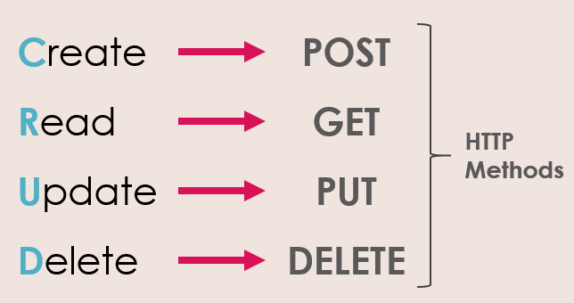
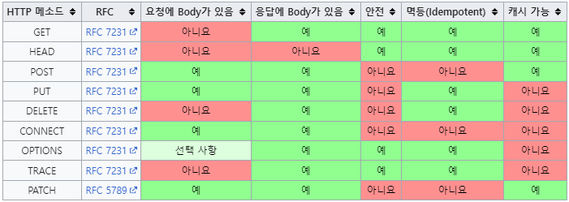

## HTTP Method

- 클라이언트와 서버 사이에 이루어지는 요청(Request)과 응답(Response) 데이터를 전송하는 방식
- 서버에 주어진 리소스에 수행하길 원하는 행동, 서버가 수행해야 할 동작을 지정하는 요청을 보내는 방법

 

#### HTTP Method 종류

- GET : 특정 리소스의 표시를 요청한다. 데이터를 조회하는 데 사용된다.
- POST : 특정 리소스에 데이터를 제출하며 새로운 리소스를 생성할 수 있다.
- PUT : 특정 리소스의 업데이트를 요청한다. 전체 리소스를 교체하는 데 사용된다.
- DELETE : 특정 리소스의 제거를 요청한다.

- PATCH : 특정 리소스의 부분적인 업데이트를 요청한다.
- HEAD : GET과 동일하지만 메시지 바디를 포함하지 않고, 리소스를 가져오지 않고 정보만을 요청한다.
- OPTIONS : 대상 리소스가 통신을 위해 어떤 메서드를 지원하는지에 대한 정보를 요청한다.
- CONNECT : 대상 자원으로 식별되는 서버에 대한 연결을 요청한다.
- TRACE : 대상 리소스에 대한 경로를 따라 메시지 루프백 테스트를 수행한다.

 

#### HTTP Method 특징

- 멱등성 (Idempotent) : 동일한 연산을 여러 번 적용하더라도 결과가 달라지지 않는다.
- 안정성 (Safe) : 요청이 서버의 리소스에 변화를 주지 않는다.
- 캐시 가능 (Cacheable) : 특정 HTTP 요청의 결과를 캐시하여 재사용할 수 있다.
- 요청/응답에 Body 존재 : 요청이나 응답시 데이터를 Message Body에 담아 보낼 수 있다.

 

## 면접 질문

GET과 POST의 차이점?

GET은 정보를 조회하는 데 사용되며 서버에게 데이터를 요청합니다.
반면, POST는 서버에 데이터를 제출하여 리소스를 생성하거나 업데이트하는 데 사용됩니다.
또한 GET은 URL에 매개변수를 포함하여 데이터를 전송하지만 POST는 HTTP 메시지의 본문에 데이터를 포함해서 전송합니다.

PUT과 PATCH의 차이점?

PUT은 리소스의 전체 업데이트를 수행하며 제공된 데이터를 사용하여 리소스를 완전히 대체합니다.
반면에 PATCH는 리소스의 일부만을 업데이트하며 제공된 필드의 데이터만 변경합니다.

 POST와 PUT 메서드의 차이점?

PUT 메서드는 클라이언트가 리소스의 위치를 알고 있는 상태에서 사용하며, 해당 리소스를 완전히 새로운 것으로 대체하는 데 사용됩니다.
반면, POST 메서드는 클라이언트가 리소스의 위치를 모르는 상태에서 사용하며, 서버에게 새로운 리소스를 생성해달라는 요청을 보냅니다.

HTTP 메서드의 특징 중 멱등성에 대해 설명, 어떤 메서드가 멱등성을 가지는지?

멱등성이란 동일한 연산을 여러 번 적용하더라도 결과가 달라지지 않는 성질을 의미합니다.
HTTP 메서드 중에서 GET, PUT, DELETE, HEAD, OPTIONS 등은 멱등성을 가집니다.
예를 들어, 동일한 GET 요청을 여러 번 보내도 결과는 동일하게 유지됩니다.

HTTP 메서드의 특징 중 안전성에 대해 설명, 어떤 메서드가 안전성을 가지는지?

안전성은 요청이 서버의 리소스에 변화를 주지 않는 성질을 나타냅니다.
GET 메소드는 서버의 어떤 리소스도 변경시키지 않고, 단순히 리소스를 요청만 하기 때문에 안전한 메소드로 분류됩니다.

HTTP 메서드의 특징 중 캐시 가능에 대해 설명, 어떤 메서드가 캐시 가능한지?

캐시 가능은 특정 HTTP 요청의 결과를 캐시하여 재사용할 수 있는지 여부를 나타냅니다.
GET과 HEAD 메소드는 서버의 상태를 변경하지 않고 단지 정보를 조회하는 데 사용되기 때문에 서버로부터 한 번 받아온 정보를 클라이언트가 재사용하는 것이 가능합니다.

